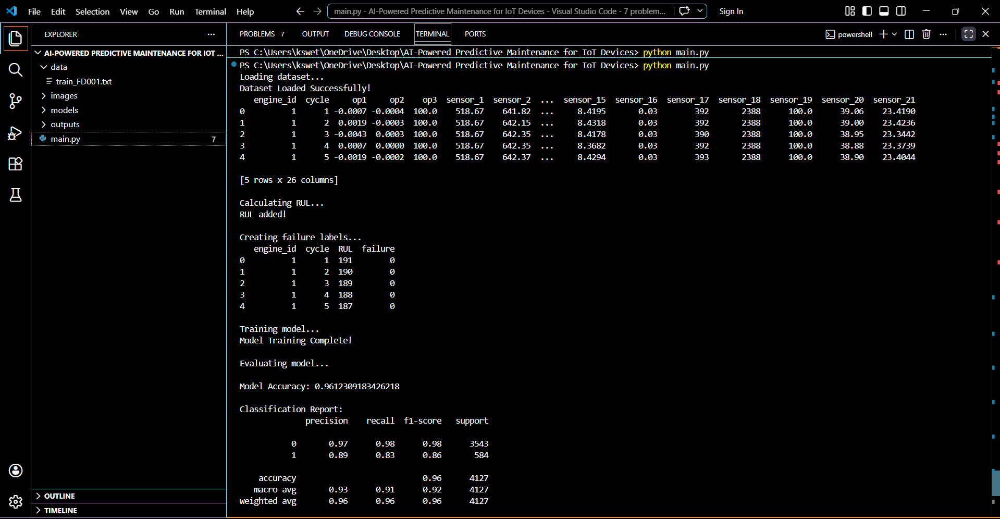
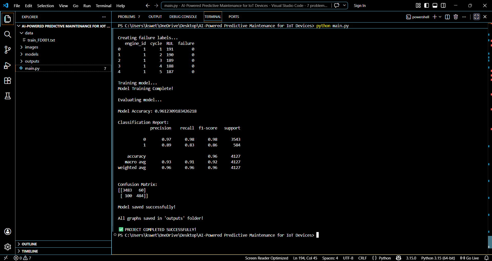
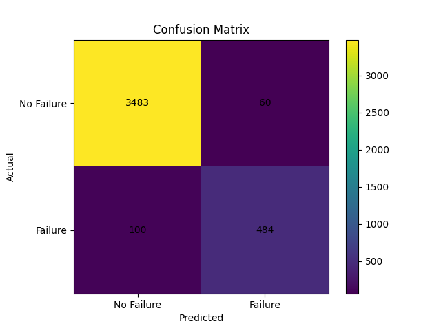
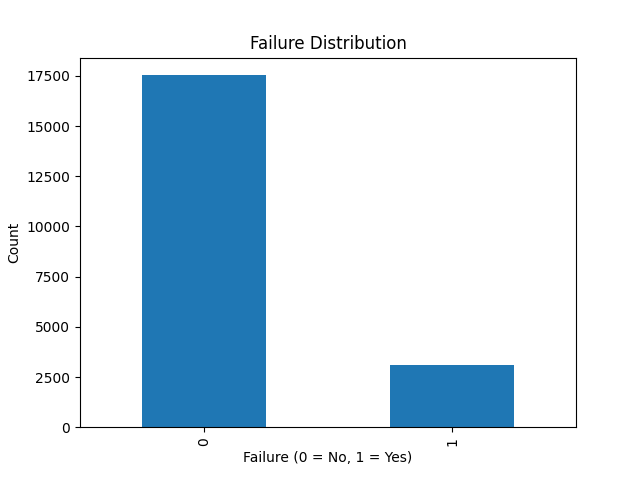
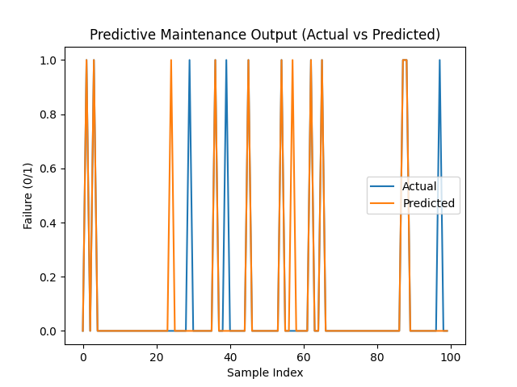
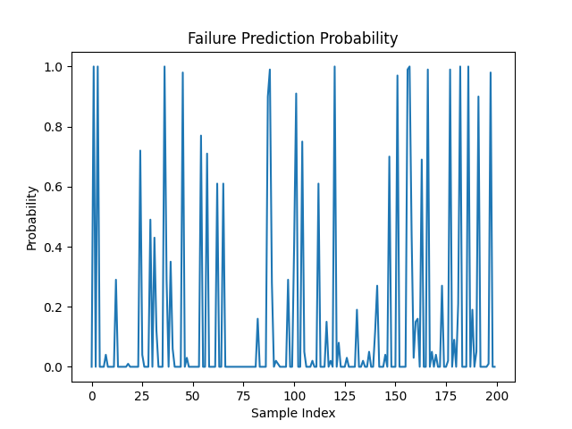
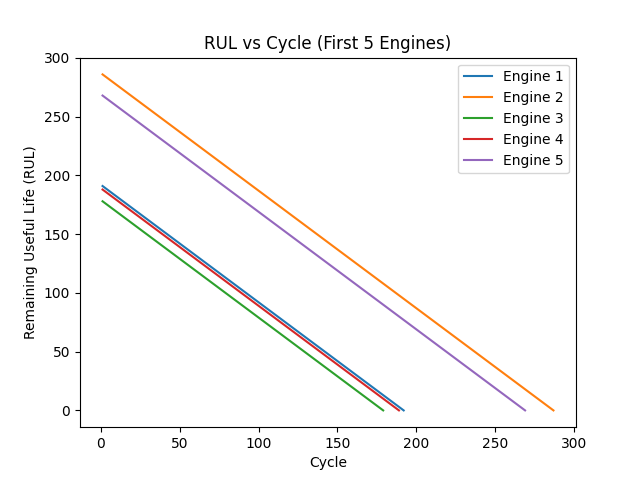

# 🚀 AI-Powered Predictive Maintenance for IoT Devices

## 📌 Overview

This project implements a machine learning-based predictive maintenance system that analyzes sensor data to detect potential equipment failures in advance. It uses historical operational data to predict whether a machine is likely to fail, enabling proactive maintenance and reducing unexpected downtime.

## ❗ Problem Statement

Traditional maintenance approaches are either reactive (fix after failure) or preventive (scheduled), both of which are inefficient. This project aims to build a predictive system that identifies failures before they occur using data-driven techniques.

## 🎯 Objectives

* Predict machine failure using sensor data
* Estimate Remaining Useful Life (RUL)
* Reduce downtime and maintenance cost
* Provide visual insights for decision-making

## 🛠️ Technologies Used

* Python
* NumPy
* Pandas
* Matplotlib
* Scikit-learn

## 📊 Dataset

* Source: Kaggle (NASA Turbofan Engine Degradation Simulation Dataset)
* Contains engine sensor readings across multiple cycles
* Used to calculate Remaining Useful Life (RUL) and failure conditions

## ⚙️ How It Works

1. Load and preprocess dataset
2. Compute Remaining Useful Life (RUL)
3. Create failure labels based on threshold
4. Split dataset into training and testing sets
5. Train model using Random Forest Classifier
6. Evaluate performance using accuracy, confusion matrix, and classification report
7. Generate visualizations for analysis

## 🧠 Machine Learning Model

* Model Used: Random Forest Classifier
* Reason for Selection:

  * Handles high-dimensional sensor data effectively
  * Captures nonlinear relationships
  * Provides high accuracy with low overfitting risk

## 📈 Results

* Accuracy: ~96%
* Strong precision and recall for both classes
* Low false positives and false negatives

## 📊 Output Screens (VS Code Execution)

### 🔹 Output Window 1



### 🔹 Output Window 2



## 📊 Visual Outputs

### 🔹 Confusion Matrix



### 🔹 Failure Distribution



### 🔹 Prediction vs Actual



### 🔹 Failure Probability



### 🔹 Remaining Useful Life (RUL)



## 📉 Key Insights

* Dataset is imbalanced (more healthy machines than failures)
* Model successfully identifies failure patterns
* RUL decreases linearly with cycles, validating correct implementation
* Predictions closely match actual outcomes

## 📁 Project Structure

```
AI-Powered-Predictive-Maintenance-IoT/
│
├── data/
├── models/
├── outputs/
├── main.py
├── README.md
├── requirements.txt
└── .gitignore
```

## ▶️ How to Run

pip install numpy pandas matplotlib scikit-learn
python main.py

## 📌 Sample Output

✅ Machine is HEALTHY

All graphs are saved in the outputs/ folder.

## 🚀 Future Improvements

* Use LSTM for time-series prediction
* Deploy using Flask or Streamlit
* Integrate real-time IoT sensor data
* Apply anomaly detection techniques

## 💡 Applications

* Smart manufacturing
* Industrial IoT systems
* Predictive maintenance platforms
* Automotive and aerospace industries

## 👩‍💻 Author

Swetha K


## ⭐ Conclusion

This project demonstrates how machine learning, specifically Random Forest, can be applied to predictive maintenance using real-world industrial data. It improves efficiency, reduces downtime, and enables intelligent decision-making.
